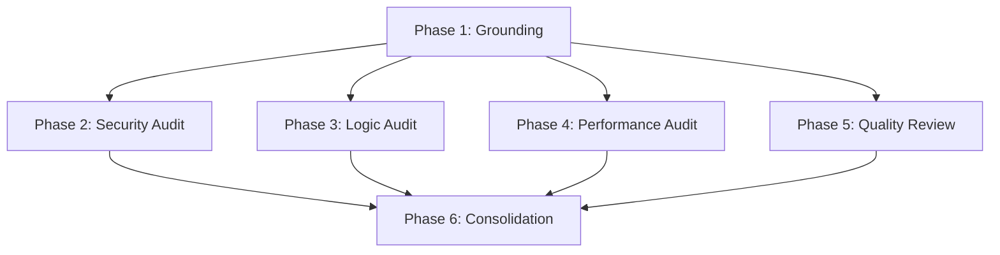

# Implementation Plan: MARK5 Codebase Full Audit

## 1. Plan Overview
This plan outlines a multi-agent, parallelized audit of the MARK5 codebase. Five specialized agents will conduct deep manual reviews across security, logic, quality, and performance domains. The audit will cover all source code and external dependencies, excluding large binary model weights. Results will be consolidated into a unified Markdown report.

- **Total Phases**: 6
- **Agents Involved**: `architect`, `security_engineer`, `debugger`, `performance_engineer`, `code_reviewer`, `technical_writer`
- **Estimated Effort**: High (Manual review of 5000+ files)
- **Execution Mode**: Parallel (Batch A for audit phases)

## 2. Dependency Graph

## 3. Execution Strategy Table
| Stage | Phases | Agent(s) | Parallel |
|-------|--------|----------|----------|
| **1: Grounding** | 1 | `architect` | No |
| **2: Audit Batch A** | 2, 3, 4, 5 | `security_engineer`, `debugger`, `performance_engineer`, `code_reviewer` | Yes |
| **3: Reporting** | 6 | `technical_writer` | No |

## 4. Phase Details

### Phase 1: Architectural Grounding & Scope Finalization
- **Objective**: Map the repository structure, identify key entry points (FastAPI main, trading loops, etc.), and finalize the file manifest for each audit domain.
- **Agent Assignment**: `architect` (Expertise in codebase mapping).
- **Implementation Details**:
  - Identify all high-risk files (e.g., authentication logic, trading execution, data sanitization).
  - Map data flows between `core/`, `database/`, and `dashboard/`.
  - Finalize exclusion list (non-code files in `models/`, logs, cache).
- **Validation Criteria**:
  - A comprehensive file manifest and architecture map provided in the Task Report.
- **Dependencies**: None.

### Phase 2: Security Audit (Source & Dependencies) [Parallel: Batch A]
- **Objective**: Manual review of source code for OWASP Top 10 and vulnerability scan of dependencies.
- **Agent Assignment**: `security_engineer` (Expertise in vulnerability analysis).
- **Implementation Details**:
  - Review `dashboard/` for IDOR, SQLi (if any custom SQL), and XSS.
  - Review `core/` for insecure data handling and sensitive info leaks.
  - Scan `.venv/` and `node_modules/` for known CVEs using `osvScanner`.
- **Validation Criteria**:
  - List of security findings with severity (Low/Med/High/Critical) and remediation steps.
- **Dependencies**: Phase 1.

### Phase 3: Logic & Reliability Audit [Parallel: Batch A]
- **Objective**: Review trading and analytics logic for bugs, edge cases, and reliability issues.
- **Agent Assignment**: `debugger` (Expertise in root cause and logic analysis).
- **Implementation Details**:
  - Audit `core/trading/` and `core/analytics/` for algorithmic errors.
  - Check error handling and recovery in execution loops.
  - Identify potential race conditions in async operations.
- **Validation Criteria**:
  - Documented logic flaws and reliability risks with impact analysis.
- **Dependencies**: Phase 1.

### Phase 4: Performance & Scalability Audit [Parallel: Batch A]
- **Objective**: Identify performance hotspots and resource usage inefficiencies.
- **Agent Assignment**: `performance_engineer` (Expertise in profiling).
- **Implementation Details**:
  - Analyze computational bottlenecks in `core/optimization/` and `core/analytics/`.
  - Review database query efficiency and caching strategies.
  - Identify memory leaks or excessive resource consumption in long-running processes.
- **Validation Criteria**:
  - List of performance bottlenecks and optimization recommendations.
- **Dependencies**: Phase 1.

### Phase 5: Code Quality & Architecture Review [Parallel: Batch A]
- **Objective**: Evaluate maintainability, technical debt, and adherence to conventions.
- **Agent Assignment**: `code_reviewer` (Expertise in quality standards).
- **Implementation Details**:
  - Assess naming conventions, modularity, and layering across the project.
  - Identify code smells, duplication, and excessive complexity.
  - Review test coverage and infrastructure quality in `tests/`.
- **Validation Criteria**:
  - Quality score per module and prioritized list of technical debt items.
- **Dependencies**: Phase 1.

### Phase 6: Consolidation & Final Reporting
- **Objective**: Merge all specialized findings into a unified, actionable Markdown report.
- **Agent Assignment**: `technical_writer` (Expertise in structured documentation).
- **Implementation Details**:
  - Reconcile findings from Security, Quality, Logic, and Performance agents.
  - Prioritize remediation steps based on overall system risk.
  - Generate the final `audit_report.md` in the `reports/` directory.
- **Validation Criteria**:
  - A cohesive, professional audit report that satisfies REQ-4.
- **Dependencies**: Phase 2, 3, 4, 5.

## 5. File Inventory
| Phase | Action | Path | Purpose |
|-------|--------|------|---------|
| 6 | Create | `reports/audit_report.md` | Final unified audit findings. |

*Note: Phases 1-5 are analysis phases and do not modify the codebase. They produce internal Task Reports used by Phase 6.*

## 6. Risk Classification
| Phase | Risk | Rationale |
|-------|------|-----------|
| 1 | LOW | Standard mapping task. |
| 2-5 | HIGH | Manual review of 5000+ files is high effort and may hit turn limits. |
| 6 | MEDIUM | Requires careful reconciliation of diverse agent findings. |

## 7. Execution Profile
- **Total phases**: 6
- **Parallelizable phases**: 4 (in 1 batch: Batch A)
- **Sequential-only phases**: 2
- **Estimated parallel wall time**: 3-4 hours
- **Estimated sequential wall time**: 10-12 hours

## 8. Cost Estimation
| Phase | Agent | Model | Est. Input | Est. Output | Est. Cost |
|-------|-------|-------|-----------|------------|----------|
| 1 | `architect` | Pro | 50K | 2K | $0.58 |
| 2 | `security_engineer`| Pro | 200K | 5K | $2.20 |
| 3 | `debugger` | Pro | 200K | 5K | $2.20 |
| 4 | `performance_engineer`| Pro | 100K | 3K | $1.12 |
| 5 | `code_reviewer` | Pro | 200K | 5K | $2.20 |
| 6 | `technical_writer` | Pro | 50K | 10K | $0.90 |
| **Total** | | | **800K** | **30K** | **$9.40** |

*Note: Token estimates are high due to the large file count and "Full Audit" requirement.*
