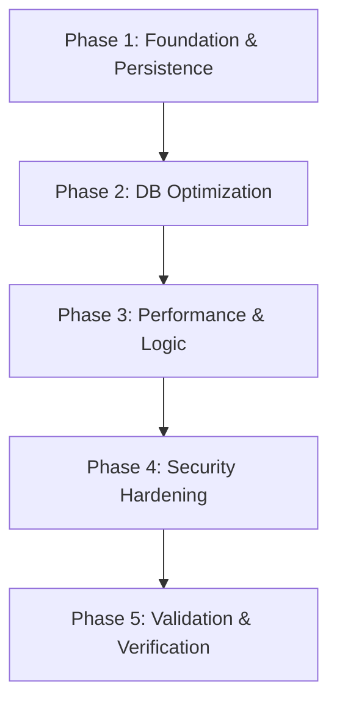

# Implementation Plan: MARK5 Grassroot Remediation

## 1. Plan Overview
This plan outlines the "grassroot" remediation of the MARK5 codebase based on the post-audit findings. It involves structural changes to persistence, performance optimizations via vectorization, database indexing, and security hardening.

- **Total Phases**: 5
- **Agents Involved**: `coder`, `data_engineer`, `security_engineer`, `tester`
- **Estimated Effort**: Medium
- **Execution Mode**: Sequential (Precision logic and schema changes)

## 2. Dependency Graph

## 3. Execution Strategy Table
| Stage | Phases | Agent(s) | Parallel |
|-------|--------|----------|----------|
| **1: Persistence** | 1 | `coder` | No |
| **2: Data Layer** | 2 | `data_engineer` | No |
| **3: Core Logic** | 3 | `coder` | No |
| **4: Security** | 4 | `security_engineer` | No |
| **5: Validation** | 5 | `tester` | No |

## 4. Phase Details

### Phase 1: Foundation & Persistence Relocation
- **Objective**: Move volatile trader state from `/tmp/` to `data/state/` and ensure directory persistence.
- **Agent Assignment**: `coder`
- **Files to Modify**:
  - `core/trading/autonomous.py`: Update `state_path` default and add `os.makedirs` logic.
- **Implementation Details**:
  - Change default path from `/tmp/mark5_trader_state.json` to `data/state/mark5_trader_state.json`.
  - Add logic in `__init__` or `_save_state` to create parent directory if it doesn't exist.
- **Validation Criteria**:
  - `python -c "from core.trading.autonomous import AutonomousTrader; t=AutonomousTrader(); print(t.state_path)"` shows new path.
  - Directory `data/state/` exists after first save attempt.
- **Dependencies**: None.

### Phase 2: Database Schema & Indexing
- **Objective**: Add performance indexes to the `trade_journal` table.
- **Agent Assignment**: `data_engineer`
- **Files to Modify**:
  - `core/infrastructure/database_manager.py`: Add `CREATE INDEX` statements to `init_database`.
- **Implementation Details**:
  - Add indexes: `idx_trade_journal_stock` ON `trade_journal(stock)`, `idx_trade_journal_status` ON `trade_journal(status)`, `idx_trade_journal_timestamp` ON `trade_journal(timestamp DESC)`.
  - Use `IF NOT EXISTS` for all statements.
- **Validation Criteria**:
  - `sqlite3 database/main/mark5.db ".indices trade_journal"` lists the new indexes.
- **Dependencies**: Phase 1.

### Phase 3: Performance Vectorization & Logic Fixes
- **Objective**: Vectorize feature engineering and fix P&L/TP reporting logic.
- **Agent Assignment**: `coder`
- **Files to Modify**:
  - `core/models/features.py`: Refactor `_frac_diff_ffd` using `np.convolve`.
  - `core/execution/execution_engine.py`: Update `close_position` and fill handling to surface actual price.
  - `core/trading/autonomous.py`: Implement extension counter/cap in `_manage_positions`.
- **Implementation Details**:
  - `_frac_diff_ffd`: Compute weights array once, then apply `np.convolve(s, w_arr, mode='valid')`.
  - `ExecutionEngine`: Ensure `OrderResult` in `close_position` uses the price from the actual fill event if possible, or matches the reported fill price.
- **Validation Criteria**:
  - Unit test comparing `_frac_diff_ffd` loop vs vectorized output.
  - Mock trade closure verifies `OrderResult.price` matches fill price.
- **Dependencies**: Phase 2.

### Phase 4: Security & Configuration Hardening
- **Objective**: Restrict CORS, secure DB credentials, and remove in-place `.env` mutation.
- **Agent Assignment**: `security_engineer`
- **Files to Modify**:
  - `dashboard/main.py`: Update `allow_origins`.
  - `core/data/adapters/kite_adapter.py`: Delete `_update_env_var` and calls to it.
  - `core/config/validators.py`: Ensure `TimescaleConfig.password` defaults to empty and is loaded from env.
- **Implementation Details**:
  - Set `allow_origins=["http://localhost:5173", "http://127.0.0.1:5173"]` (or similar restricted list).
  - Modify `kite_adapter.py` to stop writing tokens back to `.env`.
- **Validation Criteria**:
  - `grep -r "_update_env_var" .` returns no matches in source code.
  - Dashboard API rejects requests from arbitrary origins.
- **Dependencies**: Phase 3.

### Phase 5: Holistic Validation & Verification
- **Objective**: End-to-end verification of all fixes.
- **Agent Assignment**: `tester`
- **Implementation Details**:
  - Run full test suite.
  - Verify state persistence across simulated restarts.
  - Benchmarking `_frac_diff_ffd` performance.
- **Validation Criteria**:
  - All tests pass.
  - Audit success criteria (Design Doc Section 7) are satisfied.
- **Dependencies**: Phase 4.

## 5. File Inventory
| Phase | Action | Path | Purpose |
|-------|--------|------|---------|
| 1 | Modify | `core/trading/autonomous.py` | State persistence path. |
| 2 | Modify | `core/infrastructure/database_manager.py`| DB Indexes. |
| 3 | Modify | `core/models/features.py` | Vectorization. |
| 3 | Modify | `core/execution/execution_engine.py` | P&L reporting. |
| 3 | Modify | `core/trading/autonomous.py` | Trend extension cap. |
| 4 | Modify | `dashboard/main.py` | CORS hardening. |
| 4 | Modify | `core/data/adapters/kite_adapter.py` | Token security. |
| 4 | Modify | `core/config/validators.py` | Credential security. |

## 6. Risk Classification
| Phase | Risk | Rationale |
|-------|------|-----------|
| 1 | LOW | Path change only. |
| 2 | MEDIUM | Schema modification on existing DB. |
| 3 | MEDIUM | Algorithmic change (numerical precision). |
| 4 | LOW | Configuration hardening. |
| 5 | LOW | Validation only. |

## 7. Execution Profile
- **Total phases**: 5
- **Parallelizable phases**: 0 (Sequential precision required)
- **Sequential-only phases**: 5
- **Estimated parallel wall time**: N/A
- **Estimated sequential wall time**: 2-3 hours

## 8. Cost Estimation
| Phase | Agent | Model | Est. Input | Est. Output | Est. Cost |
|-------|-------|-------|-----------|------------|----------|
| 1 | `coder` | Pro | 15K | 1K | $0.19 |
| 2 | `data_engineer` | Pro | 15K | 1K | $0.19 |
| 3 | `coder` | Pro | 30K | 3K | $0.42 |
| 4 | `security_engineer`| Pro | 20K | 2K | $0.28 |
| 5 | `tester` | Pro | 20K | 1K | $0.24 |
| **Total** | | | **100K** | **8K** | **$1.32** |
